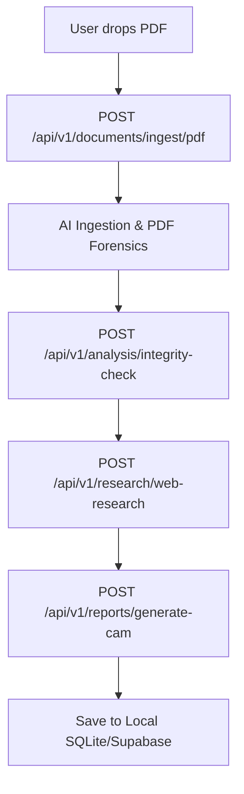

# Credent Frontend — Developer Onboarding Guide
> Technical architecture, data flows, and development guidelines for Asenra engineering interns.

Welcome to the team! This document details the technical setup and data lifecycle of the **Credent Web** application to help you ramp up quickly.

---

## 🛠️ Architecture & Technologies

The frontend is a single-page application (SPA) built with:
*   **Vite**: Fast, modern frontend build tool.
*   **React**: Component-based UI library.
*   **Axios**: Promise-based HTTP client for API communication.
*   **CSS-in-JS & Vanilla CSS**: We use clean CSS variables and class-based styles inside `src/styles/index.css` to maintain visual consistency.

---

## 🔄 Ingestion & Appraisal Data Flow

Understanding the flow of data is crucial for adding new components. Here is how a document is processed step-by-step when a user drops a file into the Appraisal Terminal:



### 1. Ingestion & Forensics
*   **Endpoint**: `/api/v1/documents/ingest/pdf` (Multipart Form Data).
*   **Action**: Backend parses the PDF text and runs metadata analytics to detect digital alteration (photoshop, PDF tools). It returns the parsed financial variables: `total_revenue`, `total_debt`, `shareholder_equity`, and an initial `base_score`.
*   **State Update**: React sets `detectedParams` and `forensicsReport`.

### 2. Tax & Ledger Cross-Validation
*   **Endpoint**: `/api/v1/analysis/integrity-check`
*   **Action**: Frontend sends tax and bank records to match monthly expected turnover. Backend returns the GSTR correlation rate (e.g., `98.4%`).

### 3. Litigation & OSINT Search
*   **Endpoint**: `/api/v1/research/web-research`
*   **Action**: Backend queries registries (MCA and court directories) for active litigations, defaults, or bankruptcy logs.

### 4. Credit Appraisal Memo (CAM) Generation
*   **Endpoint**: `/api/v1/reports/generate-cam`
*   **Action**: Combines the extracted metrics, integrity rates, and litigation logs to synthesize the Five Cs analysis (Character, Capacity, Capital, Collateral, Conditions) and output a final decision recommendation.

---

## 💡 Code Tips & Development Conventions

### State Management
*   The entire appraisal flow is governed in `src/components/EngineView.jsx`.
*   A custom logging mechanism, `addLog(category, message)`, updates the audit terminal dynamically. Feel free to add new logs when integrating features.

### API Instance Configuration
*   We use a central Axios instance defined in `src/utils/api.js`.
*   By default, it targets `http://localhost:8000/api/v1`.
*   To redirect the frontend to a deployed staging API, create a `.env` file in the root directory:
    ```env
    VITE_API_URL=https://your-staging-api.com/api/v1
    ```

### Design Guidelines
*   **Aesthetics**: Keep it clean and high-density. Avoid rounded corners greater than `4px` or `6px`.
*   **Borders**: Standard light border is `1px solid #dddddd`.
*   **Typography**: Use monospace fonts for numerical data tables to ensure perfect tabular alignment.

---

## 🧪 Testing Your Changes
To test the full end-to-end integration:
1. Ensure the FastAPI backend is running locally on port 8000.
2. In the browser, upload the test PDF file located in your downloads folder:
   👉 **`C:\Users\kpvlo\Downloads\Asenra_Solar_Power_Financials_FY25.pdf`**
3. Verify that the table populates with the dynamic financial variables (₹62.00 Cr revenue, ₹15.00 Cr borrowings) and the audit trail generates the corresponding logs.
